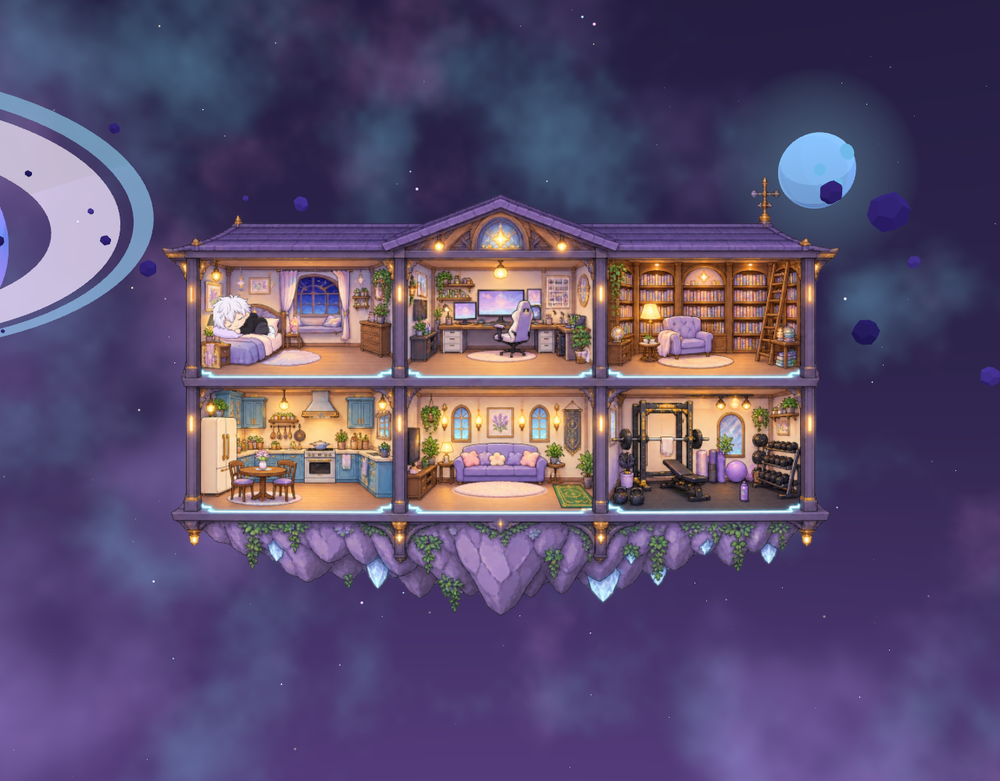
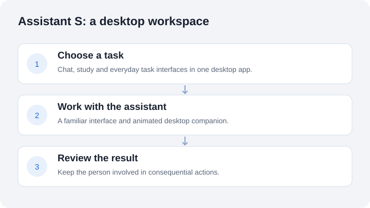

# Assistant S

**A desktop workspace with an animated companion.**

Built by **Salem Elatrash** to bring study, chat and everyday tasks into a familiar desktop interface.

[Read the project case study](https://slooma951.github.io/portfolio/case-studies/assistant-s.html) · [Explore my portfolio](https://slooma951.github.io/portfolio/)

*Screenshot of the app’s room interface. No private conversations or account data are shown.*

## What I built

An Electron desktop application with an animated 2D companion and separate interfaces for chat, study, tasks and settings. The room gives the assistant a recognisable home; the task screens provide the practical tools.

## The problem I explored

Study materials, assistant conversations and small daily tasks often live in separate windows. I wanted to explore a desktop experience where these activities feel connected and the interface has some personality.

## How the experience works

The user chooses a task, works in its dedicated screen and reviews the result. The companion supports the character of the interface without replacing the controls needed to complete the task.

## My engineering work

- Connected desktop screens, local service modules and application settings.
- Developed the room and companion interactions alongside usable task interfaces.
- Worked on the relationship between interface design, application state and desktop behaviour.

**Technologies:** Electron, JavaScript, desktop UI and a local service.

This is a personal project under development. AI coding assistance was used during implementation and verification. This overview does not claim a production deployment, independent users or a fresh complete application test run.

## Decisions and limits

The character gives the app continuity, while text and ordinary controls remain available for the task itself. Assistant output still needs review. Credentials, conversations and local application data are excluded from the public presentation.

## Repository scope

This is a documentation-only portfolio snapshot containing approved screenshots and a conceptual workflow. The application source and implementation history remain in a separate private repository. No licence to the private implementation is granted here.

For a project walkthrough, [connect on LinkedIn](https://www.linkedin.com/in/salem-elatrash/).

This public showcase is archived as a portfolio snapshot. Archiving applies to this presentation repository; product development is maintained separately in private.
